

    <h1>afl_entropy</h1>
    

        This page shows the distribution of time-to-bug measurements for every bug reached and/or triggered by the
        fuzzer. The results are grouped by target to highlight any performance trends the fuzzer may have against
        specific targets.
    

    
    <h2>libpng</h2>
    
        
        <h3>libpng_read_fuzzer</h3>
        

        
            
            

                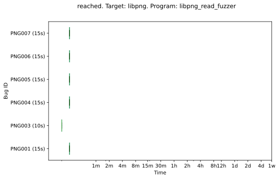
            

        
            
            

                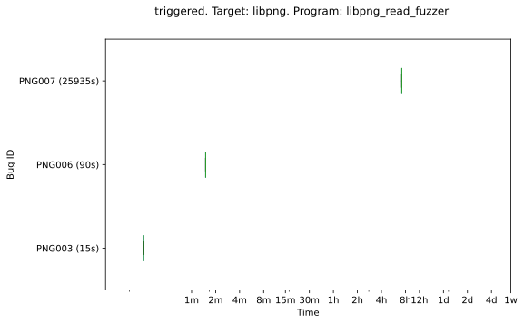
            

        
        

    

    
    <h2>libsndfile</h2>
    
        
        <h3>sndfile_fuzzer</h3>
        

        
            
            

                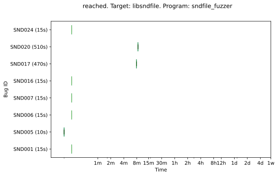
            

        
            
            

                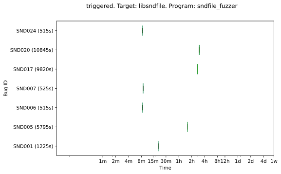
            

        
        

    

    
    <h2>libxml2</h2>
    
        
        <h3>libxml2_xml_read_memory_fuzzer</h3>
        

        
            
            

                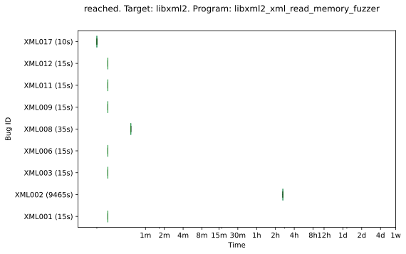
            

        
            
            

                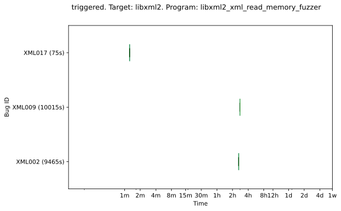
            

        
        

    
        
        <h3>xmllint</h3>
        

        
            
            

                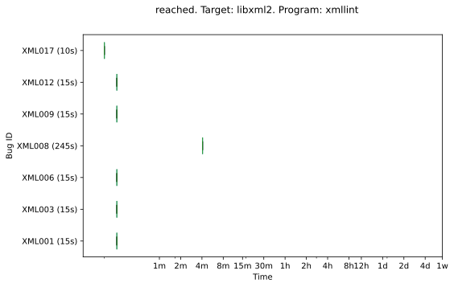
            

        
            
            

                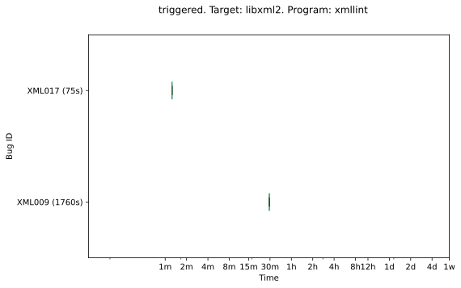
            

        
        

    

    
    <h2>lua</h2>
    
        
        <h3>lua</h3>
        

        
            
            

                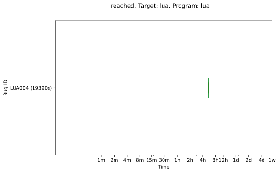
            

        
            
            

                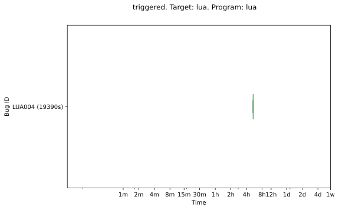
            

        
        

    

    
    <h2>openssl</h2>
    
        
        <h3>asn1</h3>
        

        
            
            

                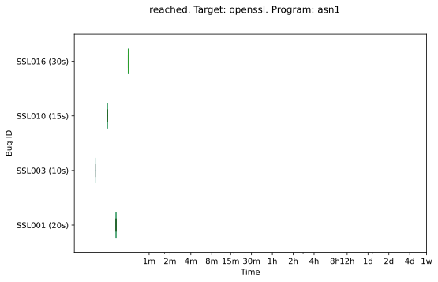
            

        
            
            

                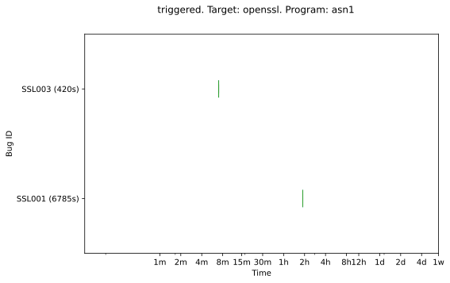
            

        
        

    
        
        <h3>asn1parse</h3>
        

        
            
            

                
            

        
        

    
        
        <h3>bignum</h3>
        

        
            
            

                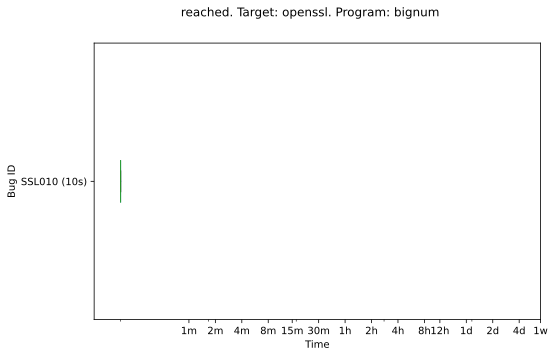
            

        
        

    
        
        <h3>client</h3>
        

        
            
            

                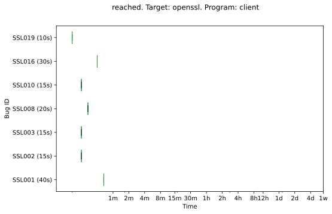
            

        
            
            

                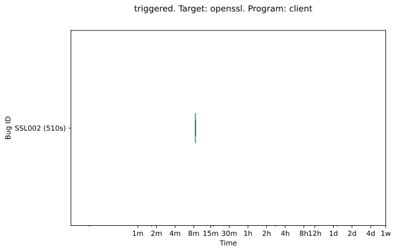
            

        
        

    
        
        <h3>server</h3>
        

        
            
            

                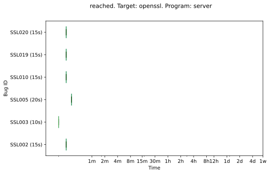
            

        
            
            

                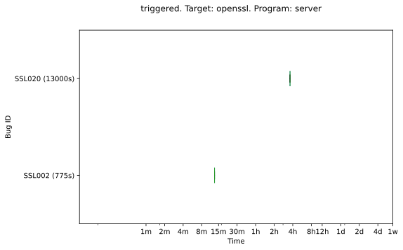
            

        
        

    
        
        <h3>x509</h3>
        

        
            
            

                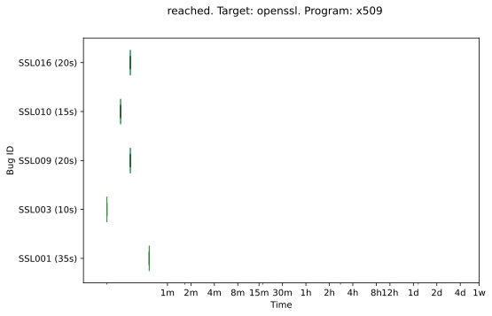
            

        
        

    

    
    <h2>php</h2>
    
        
        <h3>exif</h3>
        

        
            
            

                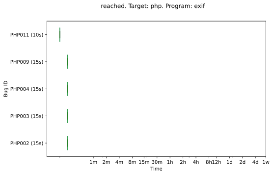
            

        
            
            

                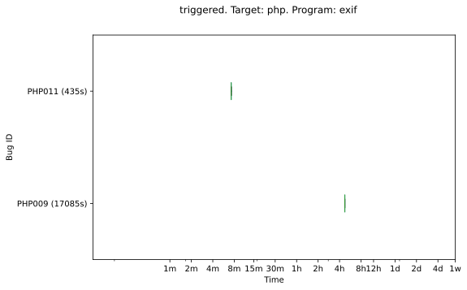
            

        
        

    

    
    <h2>poppler</h2>
    
        
        <h3>pdf_fuzzer</h3>
        

        
            
            

                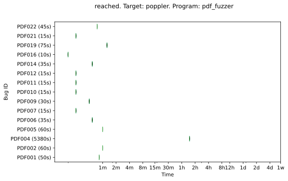
            

        
            
            

                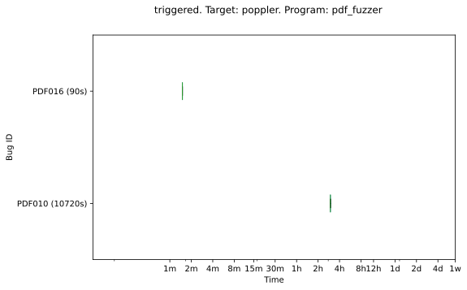
            

        
        

    
        
        <h3>pdfimages</h3>
        

        
            
            

                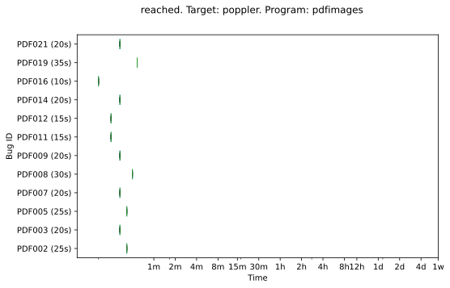
            

        
            
            

                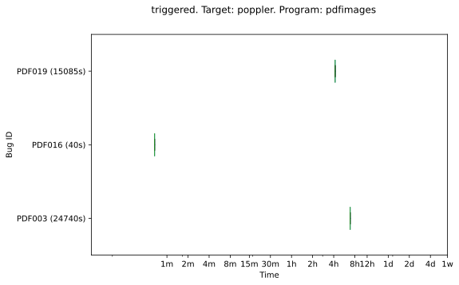
            

        
        

    
        
        <h3>pdftoppm</h3>
        

        
            
            

                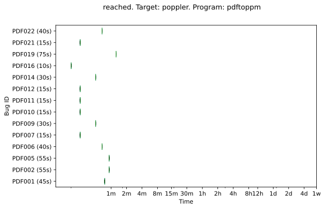
            

        
            
            

                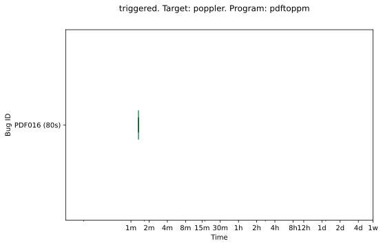
            

        
        

    

    
    <h2>sqlite3</h2>
    
        
        <h3>sqlite3_fuzz</h3>
        

        
            
            

                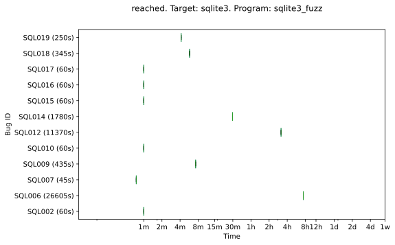
            

        
            
            

                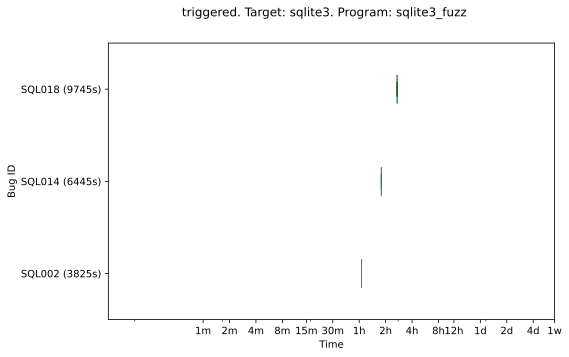
            

        
        

    


{{ template | replace: '    ', ''}}
